## tui-sudoku

tui-sudoku is a **configurable terminal interface sudoku game**, with quite a few features.

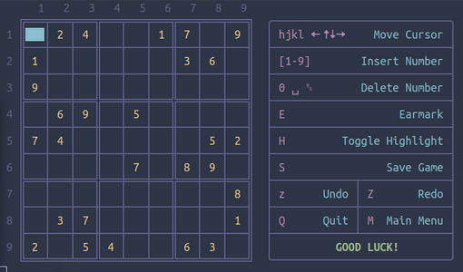


Starting the game, and through the **main menu**,
the player can :
- Start a new game
- Load previously saved game
- Configure some parameters (colors, preferred editor, puzzle symmetry,preffered png)
- exit the program

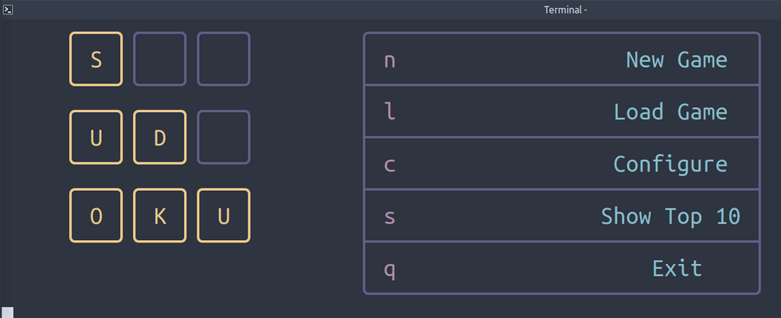

#### PLAYING THE GAME

After choosing the `n New Game` option, the player can select the level of difficulty:

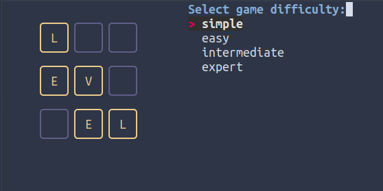

The user will be presented with the known **9x9 sudoku matrix**.


Using the shortcuts in the shown cheatsheet table, the player can


|Shorcuts     |Action     |
|-----|-----|
|  hjkl 🠄 🠅🠇🠆    | Move Cursor    |
| [1-9]    | Insert Number    |
|0,␣<space\>,␈<backspace\>       |Clear Cell     |
|  E   | Earmark cells|
|H|Toggle Highlight Numbers|
|S|Save Game|
|z,Z| Undo / Redo |
|M|Return to Main Menu|
|Q|Show Solution & Quit|

- Typing `H` while the cursor is on a number, e.g. 2, will **highlight** all the 2s in the matrix.

    Typing `H` again will **undo the highlighting**:

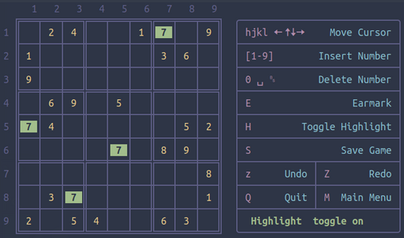

-Typing `E` and entering up to 3 digits, will **earmark the cell**:

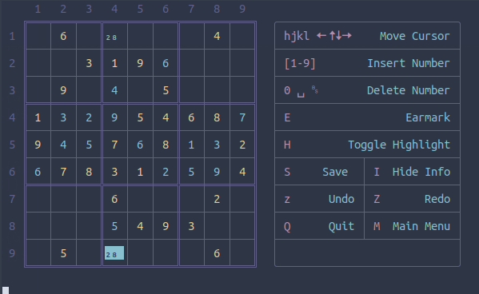

- Entering an **illegal number** (a number that *already exists in the row, the line or the 3x3 block*) will mark the number with a different color, and give a warning message:

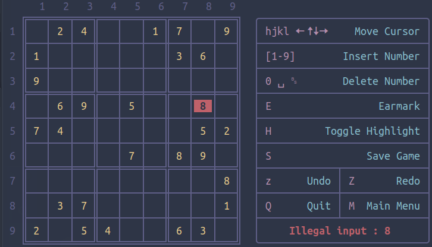

While the `M` option **returns to the `Main Menu`**, and the `S` option **saves the game**, the `Q` option **prints the solution and exits**:

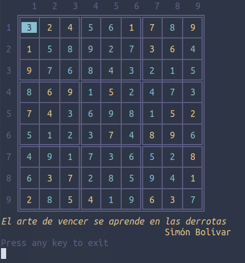

- The user can also **Undo** or **Redo** their entries with the `z` or `Z` option respectively.

    Back in the `Main Menu`, the player can also

- **Load a previously saved game** with the `l` option

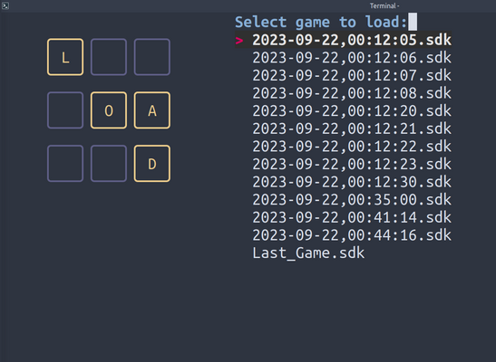

- **Configure** preferred _colors_, preferred _text editor_ and _puzzle symmetry_ with the `c` option

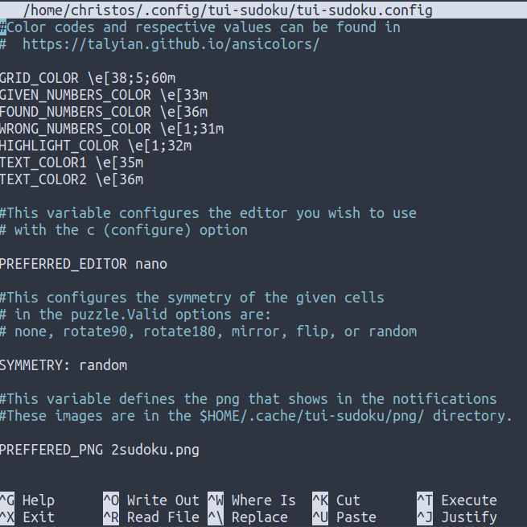

- or Browse the **Top Ten Scores** (`s` option)

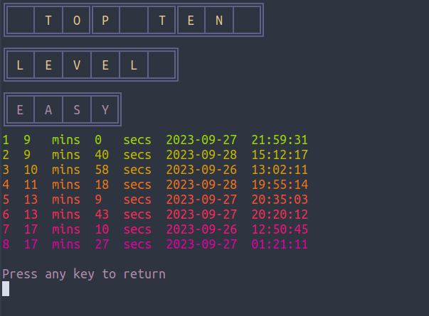

### Configure

The configuration is kept in the `$HOME/.config/tui-sudoku/tui-sudoku.config` file.

If there is no file kept there, **default values will be loaded**.


- You can select the colors you like and the respective codes as they demonstrated here:

  [https://talyian.github.io/ansicolors/](https://talyian.github.io/ansicolors/)

  **Default colors**

  | Color    | Code    | Script Variable    |
  |-----|-----|-----|
  |Grid Color|\x1b[38;5;60m"|	C1|
  |Given Numbers Color	|\e[1;33m"|C2|
  |Found Numbers Color	|\e[1;36m"|C3|
  |Wrong Numbers Color	|\e[1;31m"|C4|
  |Highlight Color	|\e[1;32m"|C5|
  |TextColor1	|\e[35m"|C6|
  |TextColor1	|\e[36m"|C7|

- `SYMMETRY` variable configures the symmetry of the given cells in the 9x9 matrix. Valid options are:
_none, rotate90, rotate180, mirror, flip, or random_

- `PREFFERED_PNG` variable defines the png that shows in the notifications. These images are located in the `$HOME/.cache/tui-sudoku/png/` directory.

 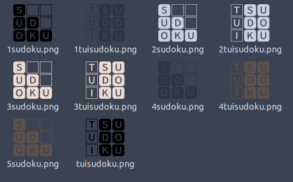

- `PREFERRED_EDITOR` variable configures the editor you wish to use with the `c` (configure) option.


### Dependencies

[qqwing](https://qqwing.com/download.html) is the main dependency of this program, as it is the command line sudoku generator.

[fzf](https://github.com/junegunn/fzf) is used in `Load` and `Level` selection functions.

[lolcat](https://github.com/busyloop/lolcat) is used to give more color to the `Top Ten` presentation.

In Debian based OSs, in order to install these dependencies:

```
sudo apt install qqwing fzf lolcat
```


### INSTALL

Clone the repo, and change directory into the program's directory:
```
git clone https://gitlab.com/christosangel/tui-sudoku
cd tui-sudoku/
```
The following commands will make the shell script executable, and copy it to the `$PATH`:
```
chmod +x tui-sudoku.sh
cp tui-sudoku.sh  ~/.local/bin/
```
Create the necessary directories:

```
mkdir -p ~/.config/tui-sudoku/ ~/.cache/tui-sudoku/saved_games/
mkdir -p  ~/.cache/tui-sudoku/png/
cp tui-sudoku.config ~/.config/tui-sudoku/tui-sudoku.config
touch ~/.cache/tui-sudoku/history.txt ~/.cache/tui-sudoku/hiscores.txt
cp -r png/ ~/.cache/tui-sudoku/
```


### RUN

Since `tui-sudoku.sh` is copied in the `$PATH`:
- Open a terminal window, and **adjust the font size to your liking, using `Ctrl` `Shift` `=` or `Ctrl` `-`**
- run:

```
tui-sudoku.sh
```

___Have fun!___
